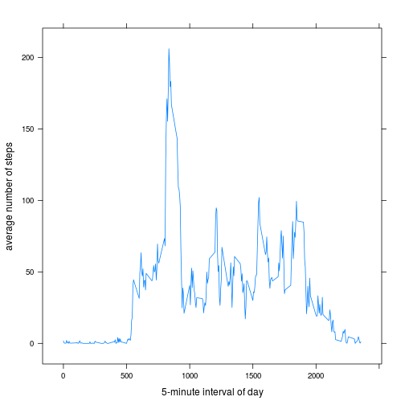
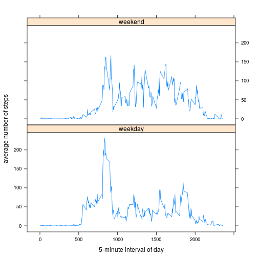

## Loading and preprocessing the data
First let's read the zipped data:

```r
data <- read.csv(unzip("activity.zip"), 
                 na.strings = "NA", 
                 colClasses = c("integer", "Date", "integer")
                 )
```
Let's see what we've got:

```r
summary(data)
```

```
##      steps             date               interval     
##  Min.   :  0.00   Min.   :2012-10-01   Min.   :   0.0  
##  1st Qu.:  0.00   1st Qu.:2012-10-16   1st Qu.: 588.8  
##  Median :  0.00   Median :2012-10-31   Median :1177.5  
##  Mean   : 37.38   Mean   :2012-10-31   Mean   :1177.5  
##  3rd Qu.: 12.00   3rd Qu.:2012-11-15   3rd Qu.:1766.2  
##  Max.   :806.00   Max.   :2012-11-30   Max.   :2355.0  
##  NA's   :2304
```

```r
head(data)
```

```
##   steps       date interval
## 1    NA 2012-10-01        0
## 2    NA 2012-10-01        5
## 3    NA 2012-10-01       10
## 4    NA 2012-10-01       15
## 5    NA 2012-10-01       20
## 6    NA 2012-10-01       25
```


## What is mean total number of steps taken per day?
We begin by grouping the data by day and finding the total steps per day:

```r
library(dplyr)
by_day <- group_by(data, date)
daily_steps <- summarize(by_day, total_steps = sum(steps, na.rm=T))
```

Now we can see the distribution of the daily total steps:

```r
hist(daily_steps$total_steps, 
     breaks=20,
     xlab="mean daily steps", main=""
     )
```

 

To get a better sense of the data we can also compute the: 

* mean: **9354.2295082** with ` mean(daily_steps$total_steps)`  
* median: **10395** with ` median(daily_steps$total_steps)`


## What is the average daily activity pattern?
Similarly, we can see the average number of steps grouped by the 5-minute time interval of a day, over all the days in our data set:


```r
by_interval <- group_by(data, interval)
interval_steps <- summarize(by_interval, avg_steps = mean(steps, na.rm=T))
```

Plotting this, we have:

```r
library(lattice)
xyplot(interval_steps$avg_steps ~ interval_steps$interval, 
       data=interval_steps, 
       type="l",
       xlab="5-minute interval of day",
       ylab="average number of steps"
       )
```

 
  
It might be interesting to know which interval has the highest average number of steps. We can find this easily:

```r
interval_steps[[which.max(interval_steps$avg_steps), "interval"]]
```

```
## [1] 835
```


## Imputing missing values
Earlier we saw that there are **2304** missing, or `NA`, values. This can be calculated using `sum(is.na(data))`.  

Now we might wish to see the impact these missing values have. Let's replace `NA`s with the average (mean) number of steps for that interval.  


```r
fdata <- data # temporary
```


## Are there differences in activity patterns between weekdays and weekends?
To compare activity levels between weekdays and weekends, we'll create a column of factor variables identifying the time of the week.

```r
fdata$tow <- as.factor(ifelse(weekdays(fdata$date) %in% c("Saturday", "Sunday"), "weekend", "weekday"))
```

Now, we can compute the average number of steps per interval as before, but this time we'll do it separately for weekdays and weekends.


```r
tow_steps <- summarize(group_by(fdata, interval, tow),
                       avg_steps = mean(steps, na.rm=T)
                       )
```

Finally, let's plot the results to compare weekday and weekend activity:


```r
xyplot(avg_steps ~ interval | tow,
       data=tow_steps, 
       type="l",
       xlab="5-minute interval of day",
       ylab="average number of steps",
       layout=c(1,2)
       )
```

 


